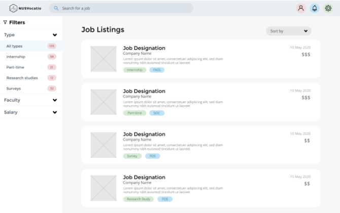

# nus-vocatio :office_worker:
### _National University of Singapore - CP2106 Independent Software Development Project (Orbital) 2020_

NUSVocatio is an application aimed to make it easier and more accessible for students to find a catalogue of various jobs available in NUS. Students can browse through the list of internships, part-time jobs, research studies and even surveys found on our website and submit their application with just a click without going through the hassle of applying a ton of forms.

This application was written for NUS CP2106 Independent Software Development Project (Orbital) 2020.

## Table of Content :scroll:
* [Tech-stack](#tech-stack-computer)
* [Getting Started](#getting-started-book)
* [Links](#links-link)
* [Screenshots](#screenshots-camera)
* [The Team](#the-team-man_technologist-woman_technologist)

## Tech-stack :computer:
* HTML/CSS/Javascript
* Vue.js
* Node.js
* MySQL


## Getting Started :book:
1. Clone repo to your local machine
2. Set up your MySQL DB
3. Create 3 files in the server/config folder
   1. ```aws.config.js``` - Add the following code and modify it accordingly to your AWS configurations
    
        ```javascript
        const aws = require("aws-sdk");

        aws.config.update({
            accessKeyId: "ACCESS_KEY_ID",
            secretAccessKey: "SECRETACCESSKEY"
        });

        module.exports = aws;
        ```
   1. ```config.js``` - Use your own secret
        ```javascript
        module.exports = {
            secret: "supersecret"
        };
        ```
   1. ```database.js``` - Configure with your own database settings
        ```javascript
        module.exports = {
            HOST: 'HOST',
            USER:'USERNAME',
            PASSWORD: 'PASSWORD',
            DB: 'DATABASE_NAME',
            dialect: 'mysql',

            pool: {
                max: 5,
                min: 0,
                acquire: 30000,
                idle: 10000
            },
        };
        ```
5. In your project directory, run
  ```
  cd/server
  npm install
  npm start 
   ```
    and on another terminal, run
     ```
    cd/client
    npm install
    npm run serve 
     ```
6. Open the application on your browser on [http://localhost:8080](http://localhost:8080)

## Links :link:
Check out our initial mockup: https://marvelapp.com/23aa2j96

Test out our app here: https://nusvocatio.herokuapp.com/

View our demo video here: https://youtu.be/2w_z4vRNSXU

View our pitch video here: https://youtu.be/RaY1sBE9Qo4

## Screenshots :camera:
Search for jobs



## The Team :man_technologist: :woman_technologist:
* [Mok Xiao Fan](https://github.com/chowzzzz)
* [Goh Chang Wei, Levron](https://github.com/Pomegrantooo)
